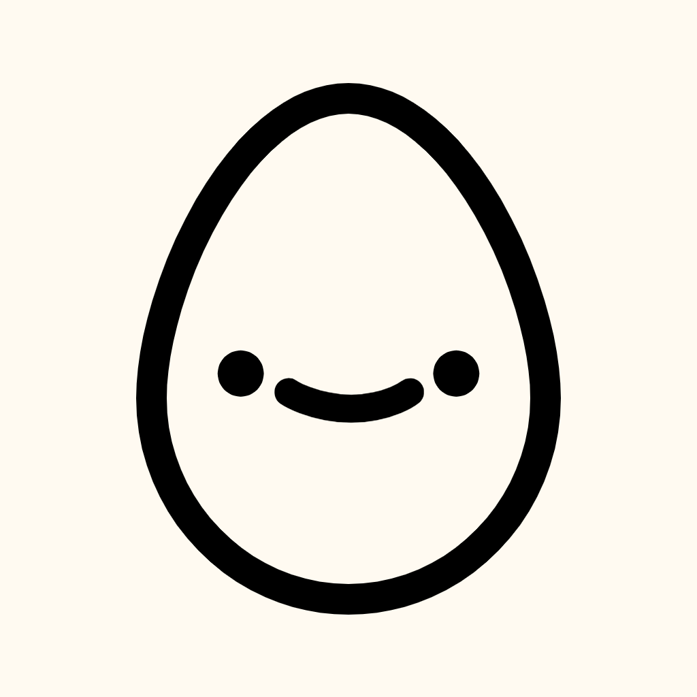

 </img>
<h1> Hello, I'm Dishant B. </h1>

### About Me:
Hello! You may know me as @eggnaut, but that's just a username. There's a lot more! I'm a 13 year old boy (he/him) who likes to code. I like to do other things than code, like play soccer and watch movies with my family. My favorite language is Python. I like to develop games and have recently started getting into web dev and software dev. I've begun to get into open source because I want to build software with a community.

You can visit my website [here](https://eggnaut.github.io).

### Current Projects:
- [euclid](https://github.com/eggnaut/euclid) (software; public)
- [da vinci](https://github.com/eggnaut/da-vinci) (framework; public)
- [personal site](https://github.com/eggnaut/eggnaut.github.io) (website; public)

### Finished Projects:
- Bugs 'n' Bunny (game; private)
- Cotton Fields (game; private)

### Contributions:

